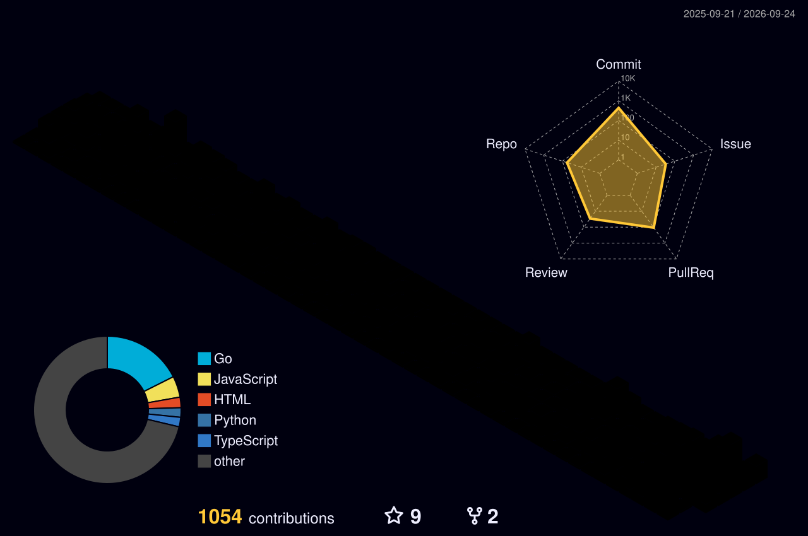

  

 

 

Hey, I'm Om. I'm a founding engineer at Ensueno in Mumbai, where I work on the API and the Postgres side of three of our services. Most of my open source stuff is in Go.

## Open source

A few of the projects that have merged my PRs:

I've also had PRs merged in [Wayfinder](https://github.com/OneBusAway/wayfinder/pulls?q=is%3Apr+author%3Aomlahore+is%3Amerged), [vehicle-positions](https://github.com/OneBusAway/vehicle-positions/pulls?q=is%3Apr+author%3Aomlahore+is%3Amerged), [OpenKruise agents](https://github.com/openkruise/agents/pulls?q=is%3Apr+author%3Aomlahore+is%3Amerged), [MDN](https://github.com/mdn/content/pulls?q=is%3Apr+author%3Aomlahore+is%3Amerged), [Stagehand](https://github.com/browserbase/stagehand/pulls?q=is%3Apr+author%3Aomlahore+is%3Amerged), [KHI](https://github.com/GoogleCloudPlatform/khi/pulls?q=is%3Apr+author%3Aomlahore+is%3Amerged), [Phase](https://github.com/phasehq/console/pulls?q=is%3Apr+author%3Aomlahore+is%3Amerged), [OpenWISP](https://github.com/openwisp/openwisp-radius/pulls?q=is%3Apr+author%3Aomlahore+is%3Amerged), [ghorg](https://github.com/gabrie30/ghorg/pulls?q=is%3Apr+author%3Aomlahore+is%3Amerged) and [gickup](https://github.com/cooperspencer/gickup/pulls?q=is%3Apr+author%3Aomlahore+is%3Amerged).

I reported three crypto bugs privately to an end to end encrypted photo service in Europe as well. The worst one was a PBKDF2 iteration count that dropped to a single round on 32 bit builds, and they confirmed all three and had fixes out the same day.

## Stack

## Activity

## Writing

- [Dead dependencies don't get archived. They get quiet.](https://medium.com/@omlahore47/dead-dependencies-dont-get-archived-they-get-quiet-5916613a7a39)
- [Your local agent is spending 39% of its system prompt on skills it will never use](https://medium.com/@omlahore47/your-local-agent-is-spending-39-of-its-system-prompt-on-skills-it-will-never-use-232f6515515c)
- [shadPS4 shipped 239 commits and none of them say "fix memory leak"](https://medium.com/@omlahore47/shadps4-shipped-239-commits-and-none-of-them-say-fix-memory-leak-a61f32b5cbd8)

